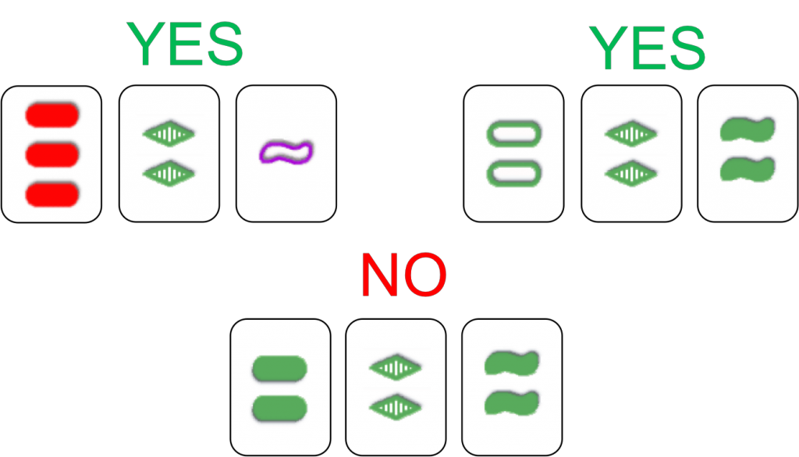

Exercises: Testing with Python
==============================

:Author: Valentin Haenel <valentin@haenel.co>
:Derivative of: `Previous material by Pietro Berkes <https://python.g-node.org/python-summerschool-2012/software_carpentry>`_
:License: `CC-BY-SA <http://creativecommons.org/licenses/by-sa/2.0/>`_
:Url: https://github.com/pcp13/testing-exercises

Exercise 1 – Writing a test suite
---------------------------------

:Level: [basic]
:Goals: Write a test suite using the ``unittest`` module.

Write a test suite, ``test_center.py``, that tests the function center in the
module string (http://docs.python.org/library/string.html#string.center). At
each step, run the tests and make sure they pass.

In the suite write three test cases:

#. The first case checks the functionality of the function, with the argument
   ``fillchar`` set to its default value.  Control that the function works as
   advertised for:

   #. Odd and even widths
   #. A width smaller than the length of the string
   #. An empty input string
   #. a string containing spaces to either extremity

Test that the length of the returned string is correct and that it looks like
you expect it to. *Hint:* when the number of spaces to be added is odd, there are
two possible ways to center a string.  The docstring does not specify which one
is correct, so you should test that the returned string is one or the other.

#. The second case checks the functionality of ``string.center``, with
   ``fillchar`` set to specific values.  Test using a letter, a numerical
   value, and the default value

#. Finally, test that ``string.center`` raises a ``TypeError`` when
   ``fillchar`` is set to an empty string or to a string longer than one
   character.

Exercise 2 - Using ``nosetests``
--------------------------------

:Level: [basic]
:Goal: learn to use the ``nosetests`` runner

#. Experiment with the ``nosetests`` runner by using it to run the test cases
   for the previous exercise.

#. Try using the ``[-v, --verbose]`` option to print which tests are run.

#. Use the syntax ``<FILE>:<CLASS>.<METHOD>`` or similar to run individual test
   cases.

#. Insert some debugging ``print`` statements and run the tests with nosetests.
   Observe that, if the test passes, the debugging lines are not printed.

Exercise 3 – Deceivingly simple function
----------------------------------------

:Level: [intermediate]
:Goal: General practice of debugging and unit testing using agile development techniques.

Enter the directory ``deceivingly_simple``. The file ``maxima.py`` contains a
function, ``find_maxima``, that finds local maxima in a list and returns their
indices.

#. Run the example code in the docstring of the function using ``doctest``, and
   make sure they pass.

#. Using IPython, test the function with these input arguments and others of
   your own invention until you are satisfied that it does the right thing for
   typical cases (remember that the function returns the indices of the maxima):

   .. code-block:: python

       x = [0, 1, 2, 1, 2, 1, 0]
       x = [i**2 for i in range(-3, 4)]

#. Now try with the following inputs:

   .. code-block:: python

       x = [4, 2, 1, 3, 1, 2]
       x = [4, 2, 1, 3, 1, 5]
       x = [4, 2, 1, 3, 1]

   For each bug you find, solve it using the agile programming strategy:

   #. Isolate the bug (use either print statements or a debugger)
   #. Write a new test case that reproduces the bug. Try to make the test case
      as simple as possible; here, this means using the simplest input data that
      still triggers the bug

   #. Correct the code
   #. Make sure that all the tests pass

#. Install the coverage module, using e.g. ``pip install coverage```. Run a
   coverage analysis on the tests:

   There should be at least one statement that is
   not covered. Write a test that covers it and debug the code.

#. You may think that the code is now clean and robust… Look at the output of
   the function for the input list ``x = [1, 2, 2, 1]`` Does the output correspond to
   your intuition? Think about a *reasonable default behavior* in this situation,
   and meditate about how such a simple function can hide so many complications.

#. Implement the *reasonable behavior* you conceived, and document it in
   the docstring, adding a new doctest.  Make sure that your function handles
   these inputs correctly (include them in the tests):

   .. code-block:: python

       x = [1, 2, 2, 3, 1]
       x = [1, 3, 2, 2, 1]
       x = [3, 2, 2, 3]

Exercise 4 - The game Set®
--------------------------

:Level: [advanced]
:Goal: Write a solver for the game Set and optimize it until it flies

Set is a logic game consisting in a deck of cards that vary along 4 dimensions:
color, shape, texture, and number.  For each dimensions, there are 3 possible
features (e.g., there are 3 possible textures: full, empty, striped).  A valid
set is formed by three cards that have on each dimension either the same
feature, or three different features.  So for example in the image below, the
first three cards are a valid set, as they are different in all features across
all dimensions; the second three cards also form a valid set, because they
share the same features for color and number, and are different in shape and
texture; the cards on the bottom are not a set, because two cards have the
“full” texture, while one is striped.



In the solitary version of the game, 12 random cards are put on the table, and
the player has to find as many valid sets as possible.  To test that you
understand the rules, visit
http://www.nytimes.com/ref/crosswords/setpuzzle.html and solve the daily puzzle
A longer description of the rules is available at
http://www.setgame.com/set/index.html. You can visit http://multiplayerset.com/
to play an online game.

In the code, we are going to represent each card by a 4-dimensional vector (for
color, shape, texture, and number); each element is either ``0``, ``1``, or
``2``, representing the three possible features for each dimension.  For
example, two cards might be represented as ``[2, 2, 0, 1]`` and ``[2, 0, 0,
0]``; this means that they have the same features for dimensions ``0`` and
``2`` and different features for dimensions ``1`` and ``3``.

Enter the directory ``set``.

#. The test module ``test_set.py`` contains a test, ``test_is_set``, for a function
   that takes a list of cards and three indices and returns ``True`` if the cards at
   those indices form a set. Implement ``is_set`` in ``set_solver.py``.

#. The test module also contains a test for a solver that finds all possible
   sets in a list of cards.  Write a brute­force Set solver, ``find_sets``: cycle
   through all possible triplets and call ``is_set`` for each triplet.  If it is a
   set, append the indices of the cards to a list.  Return the list.

#. The brute­force approach is brutally inefficient. If you already know how
   to, use a profiler to verify the bottleneck. Write a faster version,
   find_sets_fast, using list comprehensions and the function combinations from
   the module ``itertools`` (http://docs.python.org/library/itertools.html).  Test
   the new function using fuzzing: generate random cards and test that the output
   of find_sets_fast is the same of the brute force solver.  (Use the function
   ``random_cards`` in ``set_solver.py`` to generate random draws of cards.)


#. Use ``%timeit`` from IPython to measure the increase in speed.

#. (optional) Given any two cards, there is one and only one card that makes
   them form a valid set. Use this idea to write a much faster Set solver, and
   measure its performance.
